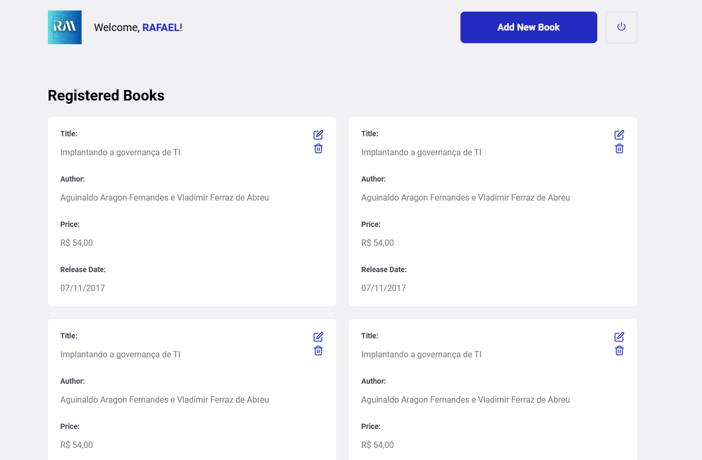
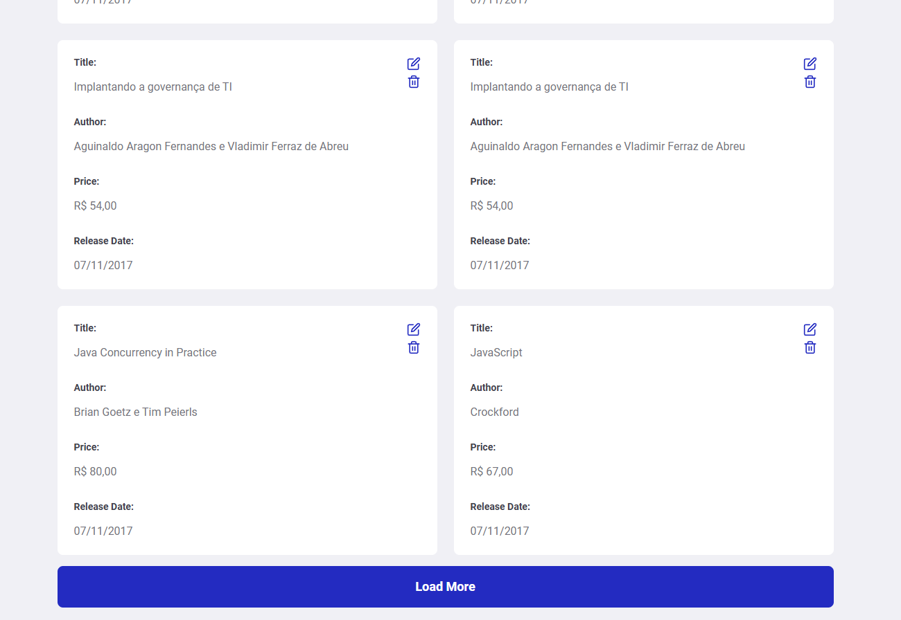
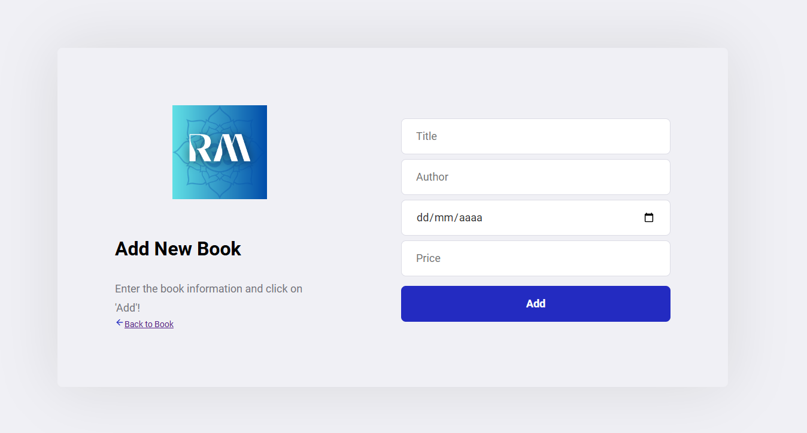

# RESTful API com Spring Boot 3 e Cliente em React

[](https://hub.docker.com/repository/docker/rafaelmaiia/rest_with_springboot_erudio)

Este projeto é uma implementação de uma API RESTful para gerenciar pessoas e livros, utilizando **Spring Boot 3** e **Java 17** no backend e **React** no frontend. O objetivo é criar uma aplicação completa com operações CRUD (Create, Read, Update, Delete) e autenticação JWT. Com essa aplicação, você pode gerenciar pessoas e livros de maneira segura e eficiente, usando práticas de desenvolvimento ágil e implantação em nuvem.

## Tecnologias Utilizadas

Durante o desenvolvimento deste projeto, foram aplicadas as seguintes tecnologias:

- **Backend**:
  - **Spring Boot 3**: Framework para construção de aplicações Java.
  - **Java 17**: Linguagem de programação utilizada no projeto.
  - **MySQL**: Sistema de gerenciamento de banco de dados relacional.
  - **Flyway**: Para controle de versões e migrações do banco de dados.
  - **Postman**: Para testes e interação com a API.
  - **Docker**: Para containerização da aplicação.
  - **Amazon Web Services (AWS)**: Implantação em um cluster ECS, incluindo EC2 e RDS.
  - **JWT e Spring Security**: Para autenticação e segurança da API.
  - **JUnit 5, Mockito, REST Assured e Testcontainers**: Para realização de testes unitários e de integração.
  - **Swagger/OpenAPI**: Para documentação da API.

- **Frontend**:
  - **React**: Framework para desenvolvimento do cliente web da aplicação.
  - **React Router**: Gerenciamento de rotas no frontend.
  - **Axios**: Para requisições HTTP ao backend.
  - **CSS Modules**: Para estilização dos componentes.
  
## Funcionalidades Principais

- **Autenticação JWT**: Login seguro para proteger as rotas da aplicação.
- **Gestão de Pessoas e Livros**: Criar, listar, atualizar e excluir registros.
- **Integração Completa entre Frontend e Backend**: Cliente React se comunica diretamente com a API Spring Boot.
- **Documentação Swagger**: Disponível para uso e teste direto das rotas da API.
  
## Estrutura do Projeto

### Backend (Spring Boot)
- Contém todos os serviços RESTful para gerenciar dados de usuários e livros.
- Implementação de segurança com autenticação JWT.
- Documentação com Swagger/OpenAPI.

### Frontend (React)
- Interface amigável com páginas para login, lista de livros e formulário de novo livro.
- Validações de formulário e feedback visual para ações do usuário.

## Capturas de Tela

Aqui estão algumas capturas do cliente React para demonstrar as principais páginas:

### Página de Login


### Página de Listagem de Livros


### Página de Listagem de Livros 2 - Carregar Mais


### Página de Adição de Novo Livro


## Como Executar

### Backend
Para executar o backend com Docker:
```bash
docker run -p 8080:8080 -d rafaelmaiia/rest_with_springboot_erudio
```
### Frontend
Instale as dependências do React:
```bash
npm install
```
Inicie o cliente React:
```bash
npm start
```
Acesse o frontend em http://localhost:3000 e interaja com a API através do cliente React.
